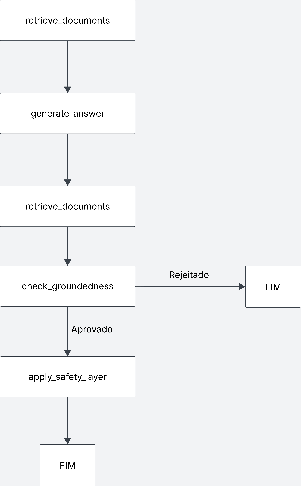

# ENEM RAG Assistant

Assistente open-source para estudantes, focado em responder dúvidas sobre as provas do ENEM a partir dos editais oficiais (2023–2025).

## Objetivo
Este projeto é uma prova de conceito (PoC) de um assistente com RAG + agentes (LangChain + LangGraph) para educação, capaz de:
- Indexar editais públicos do ENEM (PDFs de 2023 a 2025)
- Responder perguntas com citações obrigatórias (fonte + página)
- Orquestrar agentes via LangGraph: recuperador, verificador de segurança, redator com citações
- Implementar mecanismo anti-alucinação (self-check)
- Apresentar demo funcional via Streamlit

## Arquitetura
- **arquitetura do grafo:** 

- **Stack:** Python, LangChain, LangGraph, ChromaDB, HuggingFace Embeddings, Ollama (LLM open-weights), Streamlit
- **Agentes:**
  - Retriever-agent (chunking, busca densa)
  - Answerer (gera resposta com citações)
  - Self-check (recusa se faltarem evidências)
  - Safety/Policy (disclaimer, evita aconselhamento perigoso)
- **Pipeline:**
  1. Usuário faz pergunta na UI (Streamlit)
  2. Supervisor roteia para agentes
  3. Recuperador busca trechos relevantes
  4. Redator gera resposta citando fontes
  5. Self-check valida cobertura das citações
  6. SafetyAgent insere disclaimer

## Dados
- Editais do ENEM, Matriz de referença e Cartilha da Redação (PDFs 2023–2025)
- Indexação via loaders, splitters e normalização
- Embeddings OSS: bge-m3

## Avaliação
- **Perguntas de teste:**
1. Qual é o período de inscrição para o ENEM na edição de 2025?
2. Quais candidatos têm direito à isenção da taxa de inscrição no ENEM 2023?
3. Qual foi o valor da taxa de inscrição cobrada no ENEM 2023?
4. Quais documentos de identificação são aceitos no dia da prova segundo o edital do ENEM 2025?
5. O que acontece se o candidato faltar a um dos dias de prova no ENEM 2023?
6. Quais são os horários de abertura e fechamento dos portões no ENEM 2025?
7. O edital do ENEM 2023 prevê atendimento especializado para candidatos com deficiência? Como deve ser solicitado?
8. Qual é o prazo para solicitação de recurso em caso de indeferimento da isenção de taxa no ENEM 2025?
9. Quais objetos são proibidos dentro da sala de aplicação do ENEM 2023 segundo o edital?
10. Como funciona a reaplicação da prova em caso de problemas logísticos ou doenças contagiosas no ENEM 2025?

- **Respostas esperadas:**
1. Inscrições de 26 de maio a 6 de junho de 2025. 
2. Estudantes que se enquadram em critérios do edital, como: quem está no ensino médio em escola pública; Bolseiros integrais de escolas particulares com renda familiar até certo limite; inscritos no CadÚnico sob critérios de renda; ou aqueles que preencheram os requisitos legais no edital. 
3. R$ 85,00. 
4. Documento oficial com foto, podendo ser: carteira de identidade, passaporte, Carteira Nacional de Habilitação, Registro Nacional Migratório ou Provisório, documento digital com foto nos aplicativos oficiais (ex: RG digital, CNH digital), ou documento emitido por conselho de classe que seja legalmente válido. 
5. Se faltar a um dos dias, ele perde a aplicação completa — a prova daquela edição fica incompleta, não será possível utilizar o resultado para fins de seleção. 
6. Os portões abrem às 12h e fecham às 13h (horário de Brasília). 
7. Sim. Para ENEM 2023 há atendimento especializado e é possível solicitar no período de inscrição. O candidato precisa indicar essa necessidade no ato da inscrição. 
8. O recurso deve ser pedido entre 16 de junho a 20 de junho de 2025. 
9. Objeto eletrônico, relógios, bonés/chapéus que cubram cabeça/rosto, lápis, borracha, apontador, corretivo, etc.; caneta deve ser esferográfica preta de tubo transparente. (Itens proibidos são os que não constem nos permitidos; itens devem obedecer ao edital). Alguns exemplos: objetos eletrônicos como celular, relógio; acessórios que partilhem rosto; materiais de consulta. 
10. Para ENEM 2025: candidatos que faltarem por problemas logísticos ou doenças infectocontagiosas têm direito à reaplicação nos dias 16 e 17 de dezembro de 2025, desde que solicitem dentro do prazo definido, anexando documentos comprobatórios. 

- **Métricas:**
  - Faithfulness
  - Answer relevancy
  - Latência média
  - Footprint (RAM/CPU)
- **Ferramentas:** RAGAS (automática), relatório em `eval/report.md`

## Reprodutibilidade
- `requirements.txt` para setup
- Scripts de ingestão e avaliação
- Demo local via `streamlit run src/app_streamlit.py`
- Dados e passos de ingestão documentados

## Limites éticos & segurança
- Sempre informativo, sem diagnóstico ou assessoria legal
- Respostas com fontes e disclaimer
- Evita aconselhamento perigoso

## Como rodar
1. Instale dependências:
   ```bash
   pip install -r requirements.txt
   ```
2. Inicie o Ollama e ChromaDB (se necessário)
3. Execute a UI:
   ```bash
   streamlit run src/app_streamlit.py
   ```
4. Para avaliação automática:
   ```bash
   python eval/evaluate.py
   ```

## Inspirações & referências
- [LangGraph](https://github.com/langchain-ai/langgraph)
- [LangChain RAG Tutorials](https://github.com/langchain-ai/langchain)
- [Advanced-RAG-LangGraph](https://github.com/langchain-ai/advanced-rag-langgraph)
- [RAG-Based University Assistant](https://github.com/akshaybhatia10/RAG-Based-University-Assistant)

## Licença
MIT
